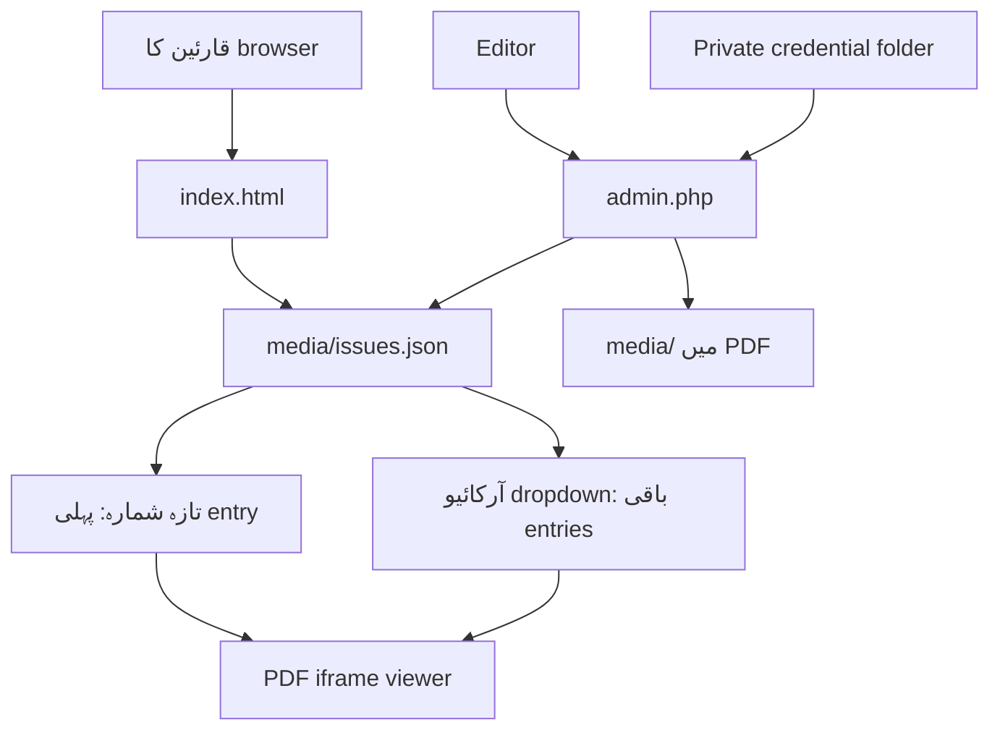

# Technical Architecture — سلطنت نیوز کراچی

## سادہ flow

`index.html` کسی framework، database یا build process کے بغیر HTML، CSS اور JavaScript استعمال کرتا ہے۔ JavaScript `media/issues.json` کو fetch کرتا ہے۔ ہر object میں `id`، `label`، `date` اور `file` ہونا ضروری ہے۔ پہلی object تازہ شمارہ ہے۔

`admin.php` اختیاری editor workflow ہے۔ یہ session password کے بعد PDF accept کرتا ہے، محفوظ نام بناتا ہے، اسے `media/` میں رکھتا ہے، اور `issues.json` میں نئی entry شروع میں شامل کرتا ہے۔ PHP کو `media/` folder میں write permission چاہیے۔

`deploy.php` اس مرحلے میں محفوظ starter ہے۔ حقیقی Git commands شامل کرنے سے پہلے branch allow-list، server path validation، CSRF protection، command allow-list، audit log اور credential separation لازمی ہیں۔

| مقام | مواد |
|---|---|
| public document root | `index.html`، `media/`، `images/`، `admin.php`، `deploy.php`، `.htaccess` |
| document root سے باہر | `.cred/saltanat-admin.php` اور مستقبل کی deploy configuration |
| Git repository | code اور documentation؛ کبھی passwords یا original private PDFs نہیں |

اگر `issues.json` موجود نہ ہو تو homepage ایک دستیاب fallback نمونہ دکھاتا ہے اور warning دیتا ہے۔ اگر local PDF کا نام غلط ہو تو viewer file نہیں کھولے گا؛ `issues.json` اور `media/` کی naming ایک جیسی رکھیں۔
